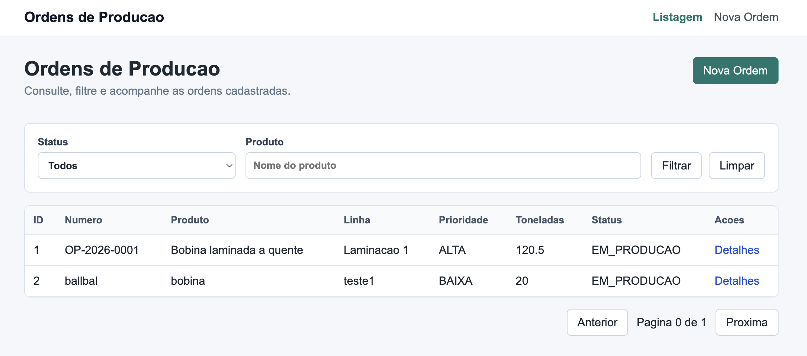
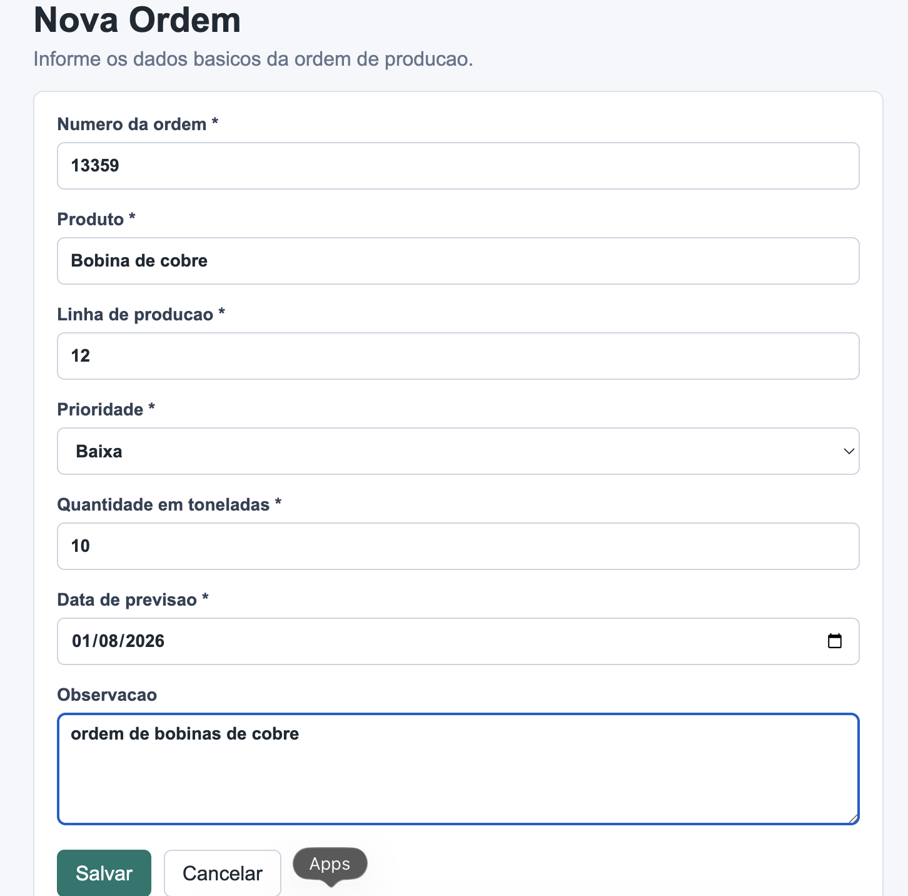
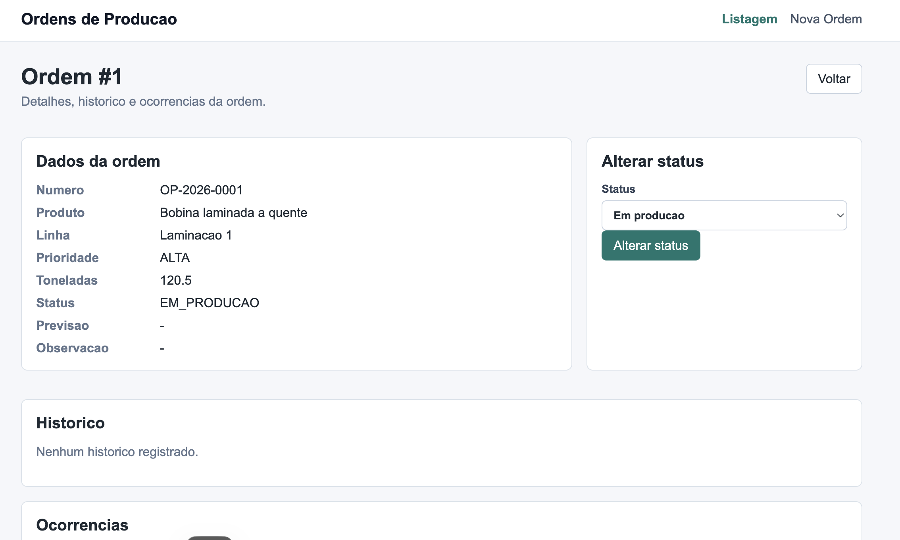
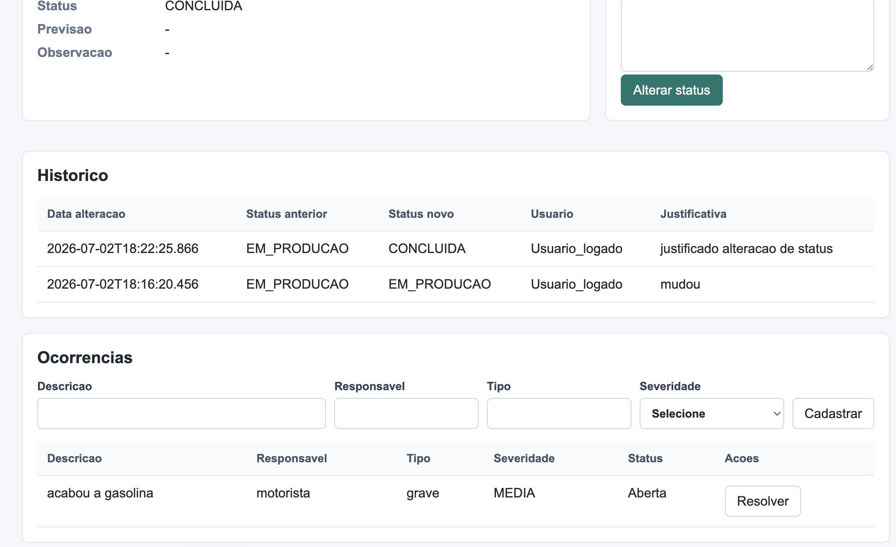

# Ordens de Producao

Aplicacao React simples para consumir uma API REST de Ordens de Producao.

## Tecnologias

- React
- Vite
- JavaScript
- React Router
- Axios
- CSS puro

## Requisitos

- Node.js
- npm
- API backend rodando em `http://localhost:8080`

## Como Rodar

Instale as dependencias:

```bash
npm install
```

Inicie a aplicacao:

```bash
npm run dev
```

Acesse no navegador:

```txt
http://localhost:5173/
```

## Scripts

```bash
npm run dev
```

Executa a aplicacao em modo desenvolvimento.

```bash
npm run build
```

Gera a versao de producao na pasta `dist/`.

```bash
npm run preview
```

Executa uma previa local do build de producao.

## API

As chamadas HTTP ficam centralizadas em:

```txt
src/services/api.js
```

A URL base configurada e:

```txt
http://localhost:8080
```

Endpoints consumidos:

- `GET /api/ordens`
- `POST /api/ordens`
- `GET /api/ordens/{id}`
- `PUT /api/ordens/{id}/status`
- `GET /api/ordens/{id}/historico`
- `GET /api/ordens/{id}/ocorrencias`
- `POST /api/ordens/{id}/ocorrencias`
- `PUT /api/ocorrencias/{id}/resolver`

## Telas

### Listagem de Ordens

Arquivo:

```txt
src/pages/OrdemLista.jsx
```

Funcionalidades:

- Listar ordens
- Filtrar ordens
- Paginar resultados
- Acessar detalhes
- Ir para cadastro de nova ordem



### Nova Ordem

Arquivo:

```txt
src/pages/OrdemForm.jsx
```

Campos principais:

- Numero da ordem
- Produto
- Linha de producao
- Prioridade
- Quantidade em toneladas
- Data de previsao
- Observacao

Validacoes feitas com React e `useState`.



### Detalhes da Ordem

Arquivo:

```txt
src/pages/OrdemDetalhes.jsx
```

Funcionalidades:

- Exibir dados da ordem
- Exibir historico
- Exibir ocorrencias
- Alterar status
- Cadastrar ocorrencia
- Resolver ocorrencia





## Estrutura

```txt
src/
  components/
    Header.jsx
    Loading.jsx
    Message.jsx
  pages/
    OrdemDetalhes.jsx
    OrdemForm.jsx
    OrdemLista.jsx
  services/
    api.js
  App.jsx
  main.jsx
  styles.css
```
